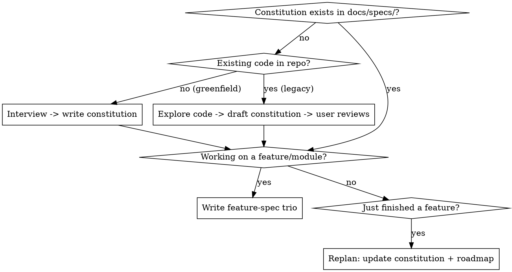

# Spec-Driven Development

## Overview

Spec-Driven Development (SDD) anchors an agent's work in **persistent specs**
instead of a long, drifting chat history. **The spec is the brain; the agent is
the muscle.** You act as architect and reviewer: you define intent and steer,
the agent drafts and implements.

Every feature runs a three-phase cycle — **Plan → Implement → Validate** — and
between features you **replan** to refine the project's direction.

Two altitudes of spec:
- **Constitution** (project level): `mission.md` (why), `tech-stack.md` (how),
  `roadmap.md` (when).
- **Feature spec** (feature/module level): `plan.md` (task groups),
  `requirements.md` (scope + decisions), `validation.md` (done criteria).

Specs live in `docs/specs/`: the constitution at `docs/specs/`, each feature in
`docs/specs/<feature-name>/`.

## Operating Principles

These govern every phase. Apply them whether or not you are using the cycle.

1. **Think Before Coding.** Don't assume; don't hide confusion. State your
   assumptions explicitly — if uncertain, ask. If multiple interpretations
   exist, present them; don't pick silently. If a simpler approach exists, say
   so. If something is unclear, stop, name what's confusing, and ask.
2. **Simplicity First.** Write the minimum that solves the problem. No features
   beyond what was asked, no abstractions for single-use code, no unrequested
   "flexibility" or config, no error handling for impossible scenarios. Ask:
   "Would a senior engineer call this overcomplicated?" If yes, simplify.
3. **Surgical Changes.** Touch only what the request requires. Don't "improve"
   adjacent code, comments, or formatting; don't refactor what isn't broken;
   match existing style. Remove only the imports/variables/functions *your*
   change orphaned. Mention pre-existing dead code — don't delete it unasked.
   Every changed line should trace to the request.
4. **Goal-Driven Execution.** Turn tasks into verifiable goals ("add validation"
   → "write tests for invalid inputs, then make them pass"). For multi-step
   work, state a brief plan with a `verify:` check per step, then loop until
   verified. Strong success criteria let you work independently; weak criteria
   ("make it work") force constant clarification.

## Where Am I? (routing)



**Always check for a constitution first.** If `docs/specs/` has no constitution,
establish one before writing a feature spec — a feature with no project anchor
is the most common failure. Don't invent the project's mission or tech stack
silently; either interview the user (greenfield) or read it off the code
(legacy), then have the user confirm.

## The Constitution (project level)

Three documents define the project. Write them to `docs/specs/`.

- **`mission.md` — why.** Problem, users, why-now, success, guiding principles.
- **`tech-stack.md` — how.** Languages, frameworks, data/storage, infra,
  conventions, hard constraints.
- **`roadmap.md` — when.** Now / Next / Later / Done.

Templates: `templates/constitution/`.

- **Greenfield:** interview the user one question at a time
  (`reference/interview-questions.md`), then draft the three docs and have the
  user review. Never invent the tech stack — propose options and confirm.
- **Legacy:** explore the code first and draft a proposed constitution, then the
  user corrects it (`reference/legacy-onboarding.md`).

## The Feature Spec (feature / module level)

For each feature or module, write three documents to `docs/specs/<feature>/`:

- **`plan.md`** — ordered task groups; what to build and in what order.
- **`requirements.md`** — scope and explicit **out-of-scope** (Simplicity
  First), plus decisions and their reasoning, surfaced assumptions, and open
  questions.
- **`validation.md`** — how you'll know it's done. **Every acceptance item
  carries a `verify:` check** (Goal-Driven Execution). Example:

  ```
  - [ ] Visiting an expired link returns 410 Gone
        verify: curl -i /<expired-slug> → HTTP/1.1 410
  ```

Templates: `templates/feature/`.

## The Feature Cycle: Plan -> Implement -> Validate

- **Plan.** Produce the feature-spec trio above.
  *Optional (if superpowers is installed): use `brainstorming` to refine the
  design and `writing-plans` to expand `plan.md` into bite-sized steps.*
- **Implement.** Build per `plan.md`, following the Operating Principles
  (especially Surgical Changes). Keep specs in sync as you go (below).
  *Optional: use `executing-plans` or `subagent-driven-development`.*
- **Validate.** Run every `verify:` check in `validation.md`; loop until all
  pass. *Optional: use `verification-before-completion`.*

## Keeping Specs in Sync

When code needs to change, prefer asking the agent to make the change so it can
**update the related spec at the same time**. Code and specs drifting apart is
the failure SDD exists to prevent — the spec is only the brain if it stays true.

## Replanning (between features)

After a feature ships, **replan**: update `roadmap.md` (move work to Done, pull
the next item into Now), revise `mission.md`/`tech-stack.md` if reality changed,
and refine your workflow. This is "run slow to run fast" — a normal step, not a
sign of failure. Don't throw out the constitution; evolve it.

## Common Mistakes

| Mistake | Fix |
|---------|-----|
| Jumping to a feature plan with no constitution | Establish `mission`/`tech-stack`/`roadmap` first; features build on it. |
| Inventing/assuming the tech stack silently | Surface it as a decision and confirm with the user (Think Before Coding); record it in `tech-stack.md`. |
| Fusing everything into one document | Separate into `plan.md` / `requirements.md` / `validation.md`. |
| Vague or implicit "done" | Every `validation.md` item needs a concrete `verify:` check. |
| Unbounded scope / building extras | Fill `requirements.md` **Out of scope**. Simplicity First. |
| Work that lives only in chat | Persist specs to `docs/specs/` so intent survives across sessions. |
| Editing code, leaving specs stale | Update the related spec in the same change. |
| Throwing out the constitution to "start clean" | Replanning evolves it; it doesn't restart it. |
